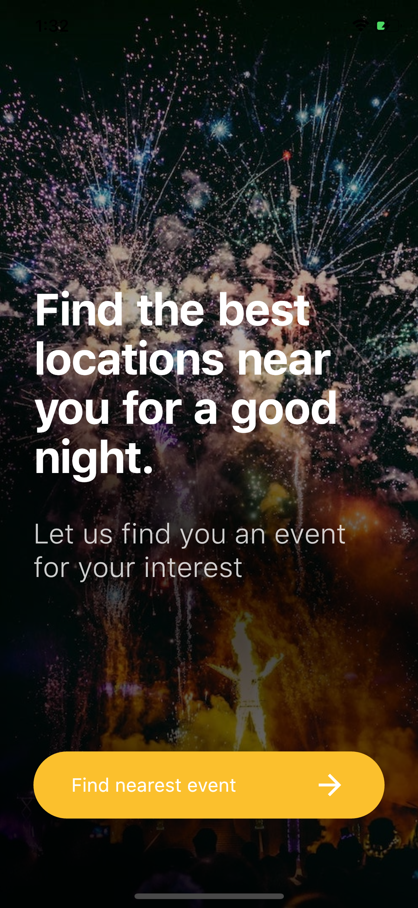
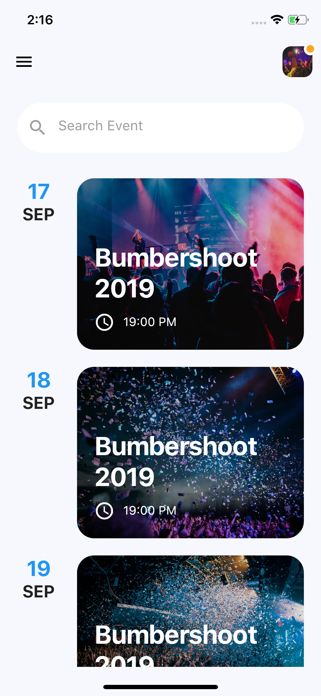

# Flutter Party Event Application UI Design

Flutter Party Event Application UI/UX design and Animation - day 9 Flutter Animation and UI Design.

This repository is a part of the 100-day design in Flutter.

In this project we use, Flutter Animation, AnimationController.

[Youtube Video](https://www.youtube.com/watch?v=pRzP34u786w)

## ScreenShot

&nbsp;

## Structure du Projet

**lib/**: Contient le code source de l'application.
  - **main.dart**: Point d'entrée principal de l'application.
  - **screen/**: Contient les écrans principaux de l'application.
    - **home_page.dart**: Écran d'accueil de l'application où les utilisateurs peuvent lancer la recherche d'événements.
    - **find_event.dart**: Écran où les événements proches sont affichés avec la possibilité de rechercher des événements spécifiques.
  - **animation/**: Contient les animations utilisées dans l'application.
    - **fade_animation.dart**: Définition d'une animation de fondu utilisée pour introduire progressivement les éléments de l'interface utilisateur.

## Description des Fichiers

1.1 main.dart

- Ce fichier constitue le point d'entrée principal de l'application Flutter. Il initialise l'application en définissant la fonction `runApp()`, qui prend en argument un widget `MaterialApp`. Le widget `MaterialApp` définit les propriétés globales de l'application, telles que le thème et la page d'accueil.

1.2 home_page.dart

- **_HomePageState** :
  Cette classe représente l'état de la page d'accueil de l'application. Elle inclut une animation d'échelle qui est déclenchée lors de l'appui sur un bouton, après quoi l'utilisateur est redirigé vers la page de recherche d'événements. 

- **AnimationController** :
  Un contrôleur d'animation utilisé pour gérer la transition de l'échelle. Lorsque l'utilisateur appuie sur le bouton "Trouver un paiya prôche", l'animation commence et augmente la taille du bouton avant de naviguer vers la page suivante.

- **FadeAnimation** :
  Les textes et les boutons sont enveloppés dans le widget `FadeAnimation`, qui permet d'ajouter une animation de fondu lorsque ces éléments apparaissent à l'écran. Cela améliore l'expérience utilisateur en ajoutant un effet visuel subtil.

1.3 find_event.dart

- **FindEvent** :
  Ce widget est responsable de l'affichage des événements disponibles. L'interface utilisateur comprend une barre de recherche en haut de l'écran pour permettre aux utilisateurs de filtrer les événements.

- **makeItem** :
  Cette fonction renvoie un widget `Row` qui affiche les détails d'un événement particulier, y compris une image de l'événement, la date, et le titre. Les événements sont listés avec un design attrayant, et chaque ligne présente une animation de fondu à l'affichage.

1.4 fade_animation.dart

- **FadeAnimation** :
  Cette classe encapsule la logique de l'animation de fondu en utilisant le package `simple_animations`. Elle combine une animation d'opacité avec une animation de translation pour créer un effet de fondu en entrant. Ce fichier est réutilisé à plusieurs endroits dans l'application pour apporter de la fluidité lors de l'affichage des éléments.

  - **MovieTween** : 
    Utilisé pour définir la séquence d'animations, incluant l'animation d'opacité (passant de 0 à 1) et de translation (d'un décalage vers la gauche à sa position finale).

